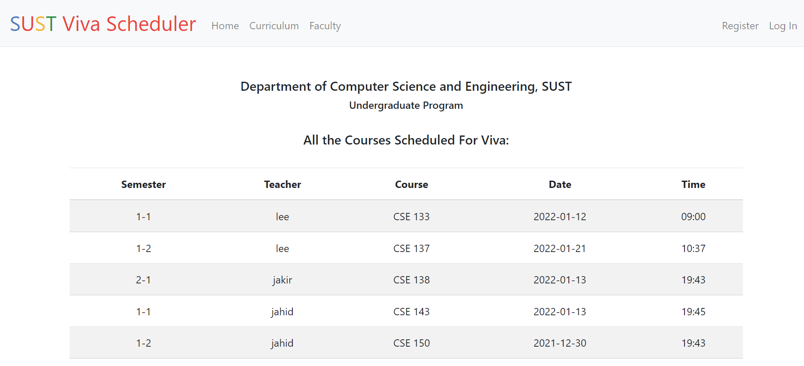
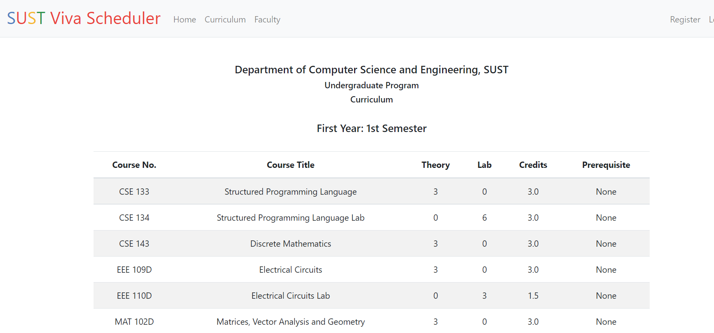
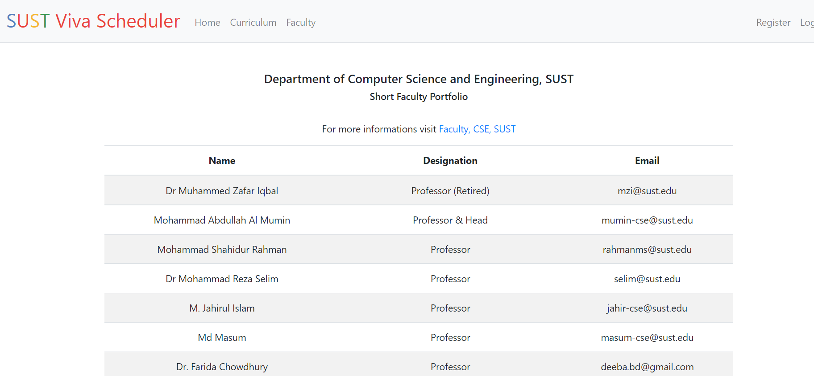
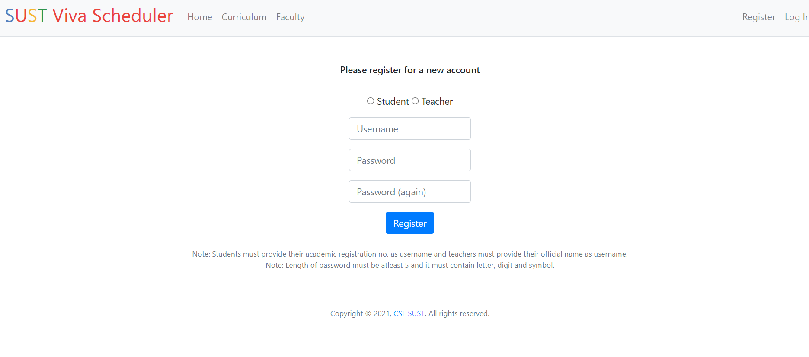
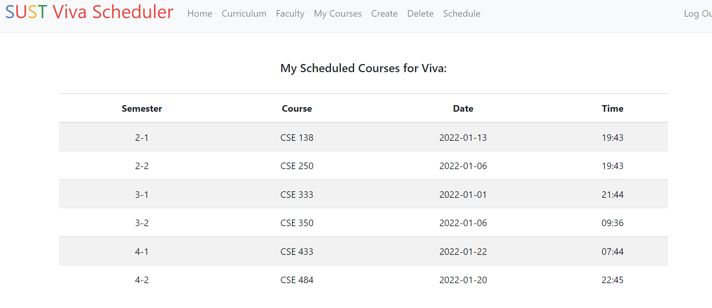
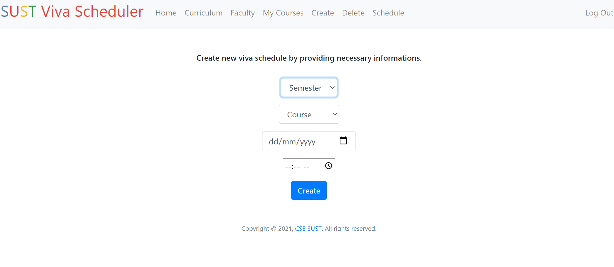
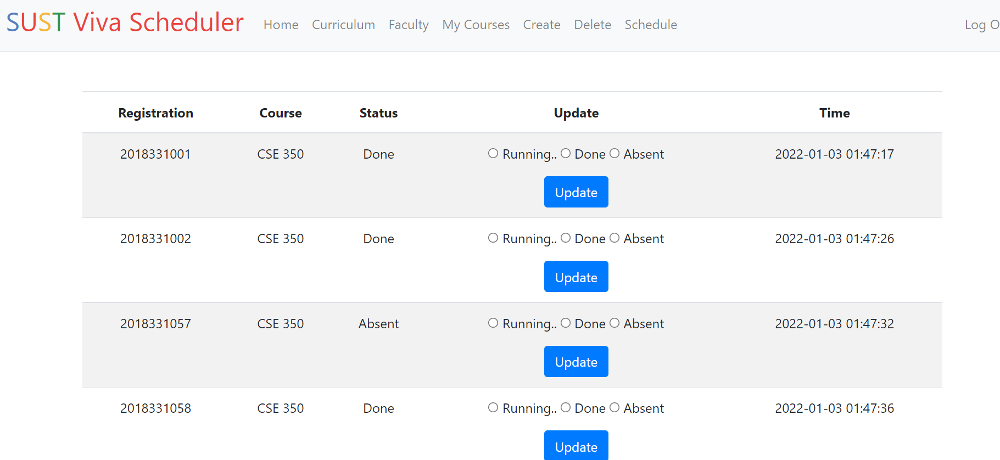
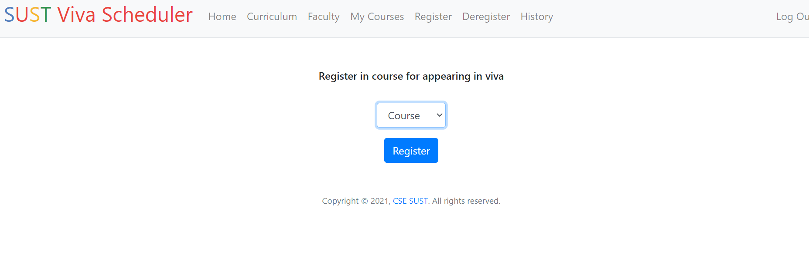
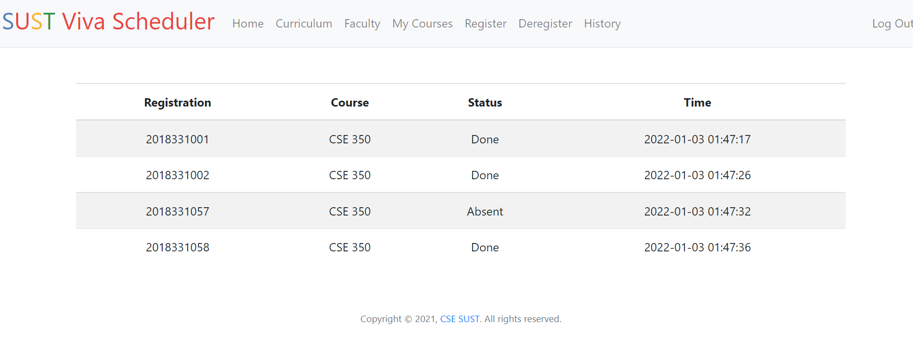

# SUST Viva Scheduler

# Expected Timeline

# Report on Learning Pre-requisites

SL | Learning Task | Description | Status | Comment |
--:|:--------------|:------------|:------:|---------|
1  | Language    | Python |   | |
2  | Web Basic    | Basics of HTML, CSS |   | |
3  | Web Framework    | Flask |   | |
4  | Database    | SQLite |   | |

# Overview
-----------
This web application, **SUST Viva Scheduler**, allows users to schedule viva and keep track of necessary informations.

* In the **homepage** user can view at a glance all the information about scheduled viva.

* **Curriculum** section allows users to view complete curriculum at CSE, SUST

* **Faculty** section gives short info about faculty members at CSE, SUST

* New user can **create an account by providing necessary informations.**

* If the user is a teacher, he can view all the courses they have created in the **My Course** section and if the user is a student they can view all the courses they have registered for appearing in viva.

* Teachers can **create new viva schedules and can also delete them.**

* Teachers can **update the status of students** in the time of viva and can view relevant information.

* Students can also **register and unregister** from course 

* Students can view complete **history** of viva in real time

# Prerequisites

SL | Learning Task | Description |
--:|:--------------|:------------|
1  | Language    | Python |  | |
2  | Web Basic    | Basics of HTML, CSS |   | |
3  | Web Framework    | Flask |   | |
4  | Database    | SQLite |  | |

# Acknowledgement

**Special thanks to**

* Enamul Hassan\
Assistant Professor, CSE, SUST\
For his valuable guideline to add curriculum, faculty section in the project and to use radio buttons instead of drop down menu.

* David J. Malan\
Professor, Harvard University\
I used CS 50’s (Which is an open course on edX conducted by David J. Malan) Finance problem set template and error handling mechanism in my project.

* CS50 IDE\
I developed my project in CS50 IDE and used cs50, SQL library (which are built into CS50 IDE) from there in my project.

# Developers

Group Number: 18\
Group Name: Project CSE-250\
Group Member Name: Jakir Hasan\
Phone Number: 01721142225\
Email: jakirhasan718@gmail.com\
Registration Number: 2018331057

<small>&copy; 2021 - Dept. of CSE, SUST, BD</small>

